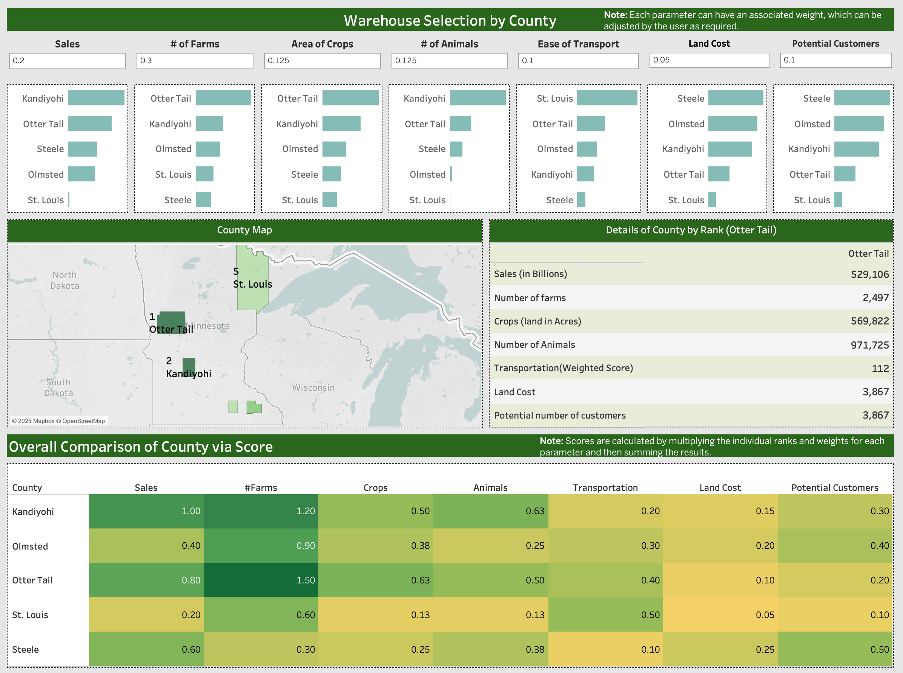

# Warehouse Location Optimization for an Agriculture Nonprofit

This project aims to support a Minnesota-based agriculture-focused nonprofit in determining the **optimal county** for establishing a new **aggregation hub**. I built a flexible scoring model using public datasets and multiple weighted factors reflecting supply, demand, and cost.

---

## 🎯 Objective

To identify the best location for expanding the nonprofit’s network of aggregation hubs that strengthen connections between farmers and local communities.

---

## 📍 Location Evaluation Framework

I assessed 5 candidate counties in Minnesota based on 3 core dimensions:

  <a href="Presentation_Slides.pdf">
    

    
### ✅ Supply
- Number of farmers  
- Harvested crop acreage  
- Livestock population  

### ✅ Demand
- Current farm sales  
- Potential number of buyers (CSA, food hubs, hospitals, schools)  

  <a href="Presentation_Slides.pdf">
    

    
### ✅ Cost
- Land cost per acre  
- Transportation infrastructure index (based on public freight network data)

Each factor was scored from 1 to 5 and weighted according to client priorities.  
The total score guided the recommended location.

  <a href="Presentation_Slides.pdf">
    

    
---

## 🧮 Methodology Steps

1. **Data sourcing** from USDA, Minnesota GIS, OpenStreetMap, and public economic data
2. **Data cleaning and metric standardization**
3. **Scoring each factor (1–5)** and applying weights
4. **Ranking counties** based on total weighted score
5. **Building a dashboard** for client collaboration and decision support

---

## 🏆 Result

> The top-ranked location demonstrated strong performance across:
> - High concentration of farms and agricultural land
> - Strong existing and potential demand
> - Moderate land cost and favorable transportation access

---

## 📊 Interactive Tableau Dashboard

  <a href="Warehouse_Location_Dashboard.twbx">
    

---

## 📄 License & Usage

This repository is for **portfolio and educational purposes only**.  
Final deliverables and presentation materials are **original student work** and **not for redistribution or reuse** without permission.

---

